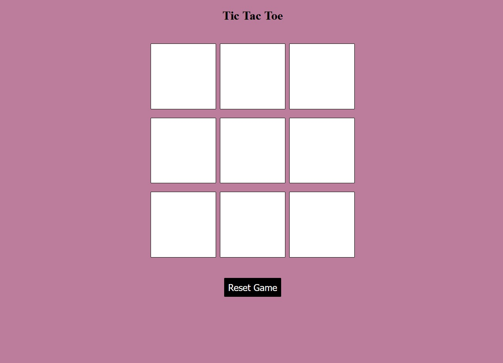
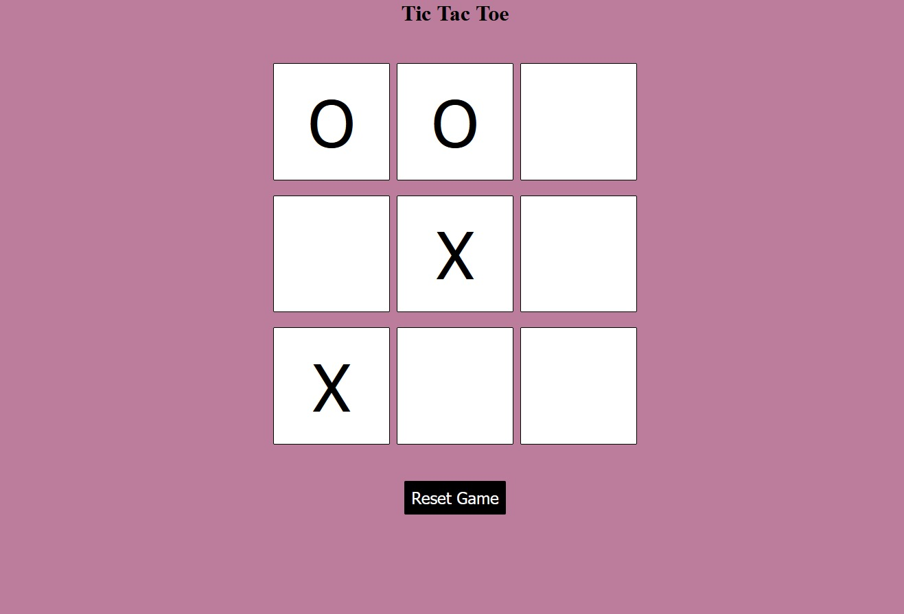

# ⭕ Tic Tac Toe

<div align="center">


A classic **Tic Tac Toe** game built with **HTML**, **CSS**, and **JavaScript**, featuring winner detection, draw detection, restart functionality, and a responsive interface.

</div>

---

# 📖 Overview

This project recreates the classic Tic Tac Toe game where two players compete on a 3×3 grid. JavaScript handles player turns, winner detection, draw conditions, and game reset.

---

# ✨ Features

- ⭕ Two-player gameplay
- 🏆 Winner detection
- 🤝 Draw detection
- 🔄 Restart game
- 📱 Responsive interface
- ⚡ Interactive gameplay

---

# 🛠 Tech Stack

- HTML5
- CSS3
- JavaScript (ES6)

---

# 📸 Screenshots

## Home



---

## Gameplay



---

# 📂 Project Structure

```text
Tic-Tac-Toe/
│
├── Screenshots/
├── index.html
├── style.css
├── script.js
└── README.md
```

---

# 🚀 Run Locally

Clone the repository

```bash
git clone https://github.com/VijayalaxmiSankpal/Tic-Tac-Toe.git
```

Open `index.html` in your browser.

---

# 💡 Future Improvements

- Single-player AI mode
- Difficulty levels
- Scoreboard
- Sound effects
- Dark mode

---

# 👩‍💻 Author

**Vijayalaxmi Sankpal**

📧 vijayalaxmisankpal@gmail.com

💼 LinkedIn  
https://www.linkedin.com/in/vijayalaxmi-sankpal-b99b4a25b

💻 GitHub  
https://github.com/VijayalaxmiSankpal

---

# ⭐ Support

If you found this project helpful, consider giving it a ⭐ on GitHub.

---

<div align="center">

**Built with HTML, CSS & JavaScript 🚀**

</div>